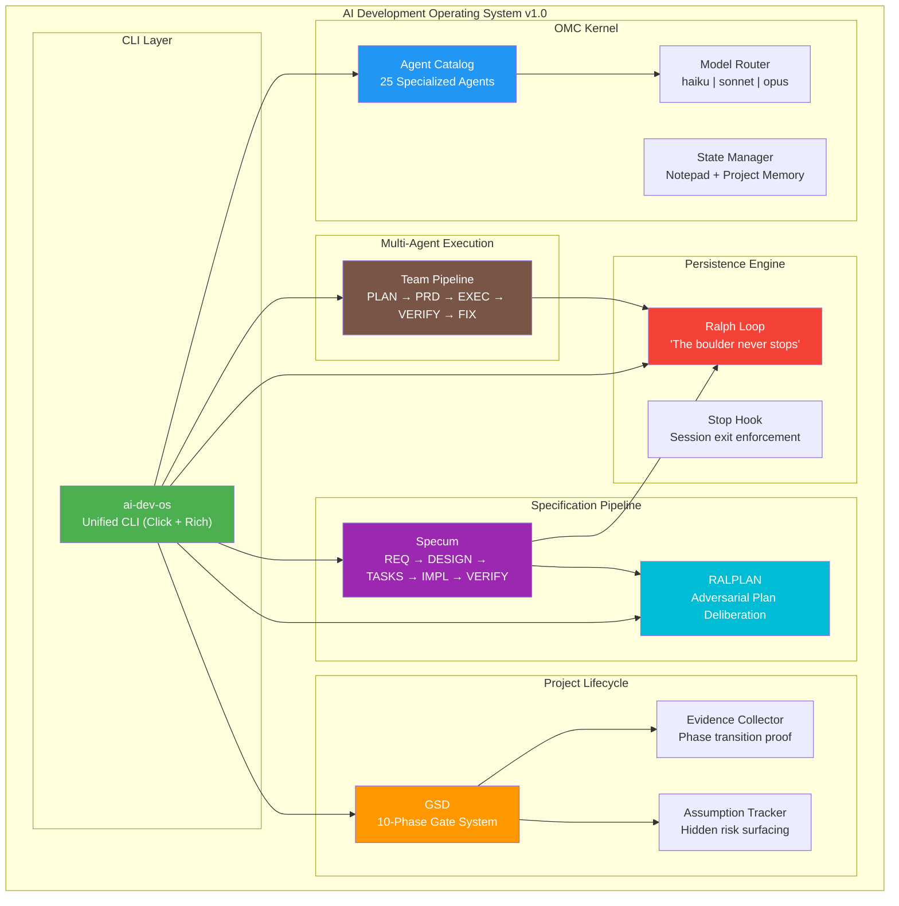
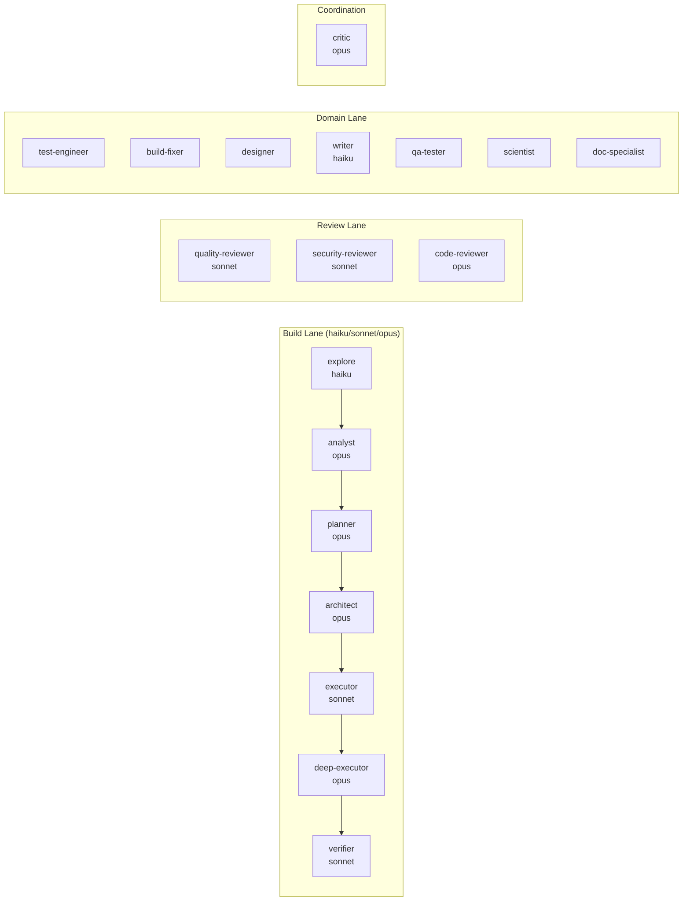
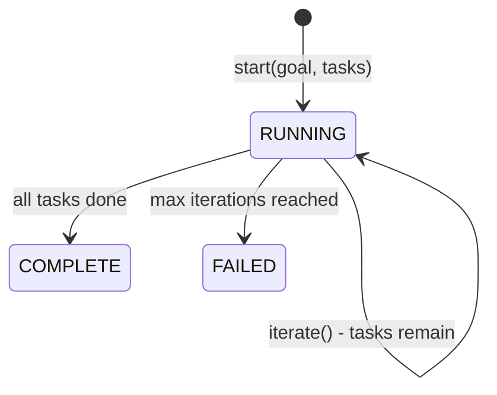
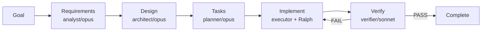
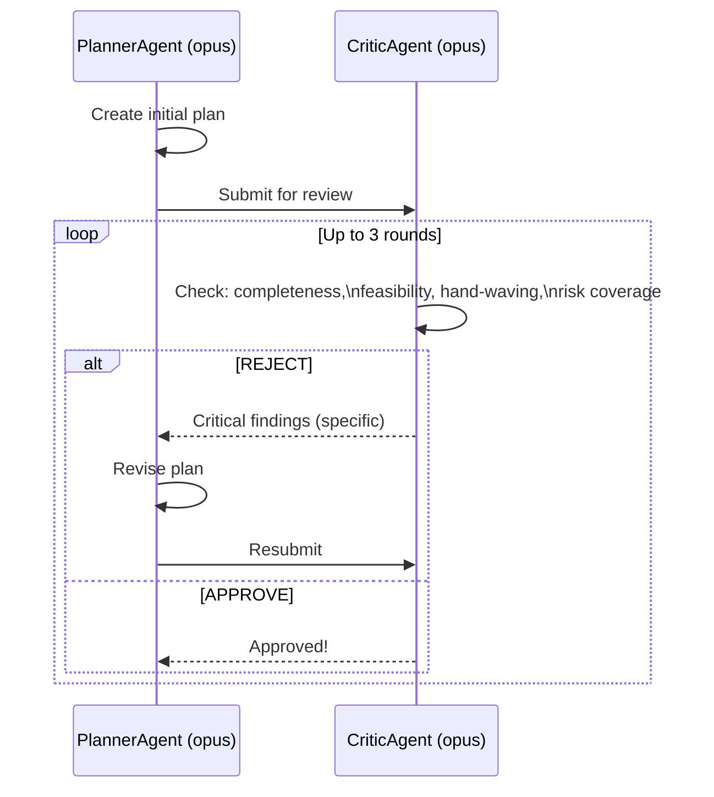

# AI Development Operating System

[](https://github.com/krzemienski)
[](https://python.org)
[](LICENSE)
[](https://pypi.org)

> **The capstone of the 10-part Agentic Development series.** A complete meta-framework for orchestrating Claude Code agents across complex software projects — combining OMC, Ralph Loop, Specum, RALPLAN, GSD, and Team Pipeline into a unified system.

---

## What Is This?

Most AI-assisted development looks like this: you open a chat, ask Claude to build something, get some code, copy-paste it, discover it doesn't quite work, ask Claude to fix it, repeat until frustrated.

The AI Development Operating System is a different approach: **structured multi-agent orchestration with persistence, specification gates, adversarial plan review, and evidence-based completion**.

After 90 days and 8,481 sessions with Claude Code, these are the patterns that actually work at scale.

---

## Full System Architecture



---

## Quick Start

```bash
# Install
pip install ai-dev-os

# Browse the 25-agent catalog
ai-dev-os catalog list
ai-dev-os catalog list --lane build
ai-dev-os catalog show architect

# Start persistent Ralph Loop
ai-dev-os ralph start --task "Build user authentication with JWT" --max-iterations 50

# Start a Specum specification pipeline
ai-dev-os spec new --goal "Implement Stripe payment processing"
ai-dev-os spec status

# Run adversarial plan deliberation (RALPLAN)
ai-dev-os plan --task "Design the microservices architecture" --consensus --deliberate

# Create a GSD project
ai-dev-os gsd new-project --name myapp --goal "Ship v1.0 of the payment system"
ai-dev-os gsd progress --name myapp

# Launch Team Pipeline
ai-dev-os team start --task "Implement the billing module" --max-fix-loops 3
```

---

## Session Economics

Why does this architecture exist? Because unstructured AI sessions are expensive and unreliable.

| Metric | Without OMC | With OMC |
|--------|------------|---------|
| Avg tokens/session | 653,000 | ~20,000 per agent |
| Context compression | None | 97% reduction |
| Completion guarantee | None | Ralph Loop enforces it |
| Spec before impl | Rarely | Always (Specum gates) |
| Plan quality | Variable | Adversarial-reviewed (RALPLAN) |
| Evidence of completion | "I think it works" | Concrete proof required |

> **8,481 sessions. 90 days. These patterns are battle-tested.**

---

## Component Overview

### OMC — Agent Catalog + Routing + State

The orchestration kernel. 25 specialized agents organized by lane, with canonical model routing and persistent state management.



```bash
# Install and use the catalog
from ai_dev_os.omc.catalog import AgentCatalog
from ai_dev_os.omc.routing import ModelRouter

catalog = AgentCatalog()
agents = catalog.get_agents_by_lane("build")  # 8 agents
router = ModelRouter()
model = router.route("architect")  # → opus
cost = router.estimate_cost(model, 5000, 2000)  # → $0.225
```

---

### Ralph Loop — Persistence Engine

The boulder never stops. Ralph Loop enforces completion through bounded iteration with JSON state persistence.



```python
from ai_dev_os.ralph_loop import RalphLoop

loop = RalphLoop()
loop.start("Build authentication system", max_iterations=100)

while not loop.state.should_stop():
    loop.iterate(task_runner=your_executor_function)

print(f"Done! {loop.state.completion_percentage()}% complete")
```

**The stop hook** (`stop_hook.sh`) prevents Claude Code from exiting when tasks remain.
Reads the state file — if incomplete, outputs "The boulder never stops" to enforce continuation.

---

### Specum — Specification Pipeline

No implementation without specification. Specum enforces five stages with artifact gates.



```python
from ai_dev_os.specum import SpecumPipeline

pipeline = SpecumPipeline()
pipeline.start("Implement JWT authentication with refresh tokens")

# Advance through each stage
while pipeline.current_stage() != "complete":
    result = pipeline.advance()
    print(f"Stage {result.stage}: {result.status}")
    # Each stage writes an artifact: requirements.md, design.md, tasks.md...
```

**Stage artifacts** (each consumes the previous):
- `requirements.md` — acceptance criteria, constraints, scope
- `design.md` — Mermaid diagrams, API contracts, tech decisions
- `tasks.md` — phased task list with verification gates
- `implementation-report.md` — evidence of completion
- `verification-report.md` — PASS/FAIL with evidence citations

---

### RALPLAN — Adversarial Deliberation

Prevent bad plans from reaching execution through iterative planner-critic dialogue.



```python
from ai_dev_os.ralplan import RalplanDeliberation

deliberation = RalplanDeliberation()
result = deliberation.start(
    "Design microservices architecture for payment system",
    deliberate=True  # Adds pre-mortem + expanded test planning
)

if result.approved:
    print(result.final_plan.to_markdown())
    print(f"Approved in {result.round_count} rounds")
```

---

### GSD — 10-Phase Project Lifecycle

From idea to production with explicit phase gates, assumption tracking, and evidence collection.


```python
from ai_dev_os.gsd import GSDProject, AssumptionTracker, EvidenceCollector, EvidenceType

project = GSDProject()
project.create_project("payment-v2", "Ship Stripe payment integration")

# Track assumptions
tracker = AssumptionTracker("payment-v2")
a = tracker.record(
    "Stripe supports idempotency keys for retries",
    source="architect", phase="research", impact="critical"
)

# Collect evidence as you work
collector = EvidenceCollector("payment-v2")
evidence = collector.collect(
    phase="execute_phase",
    evidence_type=EvidenceType.BUILD_LOG,
    title="iOS build succeeded",
    data="BUILD SUCCEEDED (0 warnings)"
)

# Advance when phase is evidenced
project.advance_phase(evidence_ids=[evidence.id])
print(project.progress_table())
```

---

### Team Pipeline — Multi-Agent Execution

Staged execution with specialized agents at each step. Fix loop is bounded to prevent infinite cycling.

```mermaid
stateDiagram-v2
    [*] --> team-plan
    team-plan --> team-prd
    team-prd --> team-exec
    team-exec --> team-verify
    team-verify --> complete: PASS
    team-verify --> team-fix: FAIL
    team-fix --> team-verify
    team-fix --> failed: max loops exceeded
```

```python
from ai_dev_os.team_pipeline import TeamPipeline

pipeline = TeamPipeline()
pipeline.start("Implement billing module", max_fix_loops=3)

while not pipeline.state.is_terminal:
    result = pipeline.advance_stage()
    print(f"Stage {pipeline.current_stage()}: {'✓' if result.success else '✗'}")

print(f"Final: {pipeline.state.status.value}")
print(pipeline.status())
```

---

## Building Your Own

You don't need to adopt everything at once. Here are 5 incremental steps,
each independently valuable:

### Step 1: Agent Specialization
Define 3-5 agent types with distinct system prompts. A planner that doesn't code.
An executor that doesn't architect. A verifier that's skeptical, not helpful.

### Step 2: Add Persistence
Write progress to a JSON file after every task. Resume from the last saved state
when sessions end. The "boulder never stops" principle.

### Step 3: Add Specification Stages
Require a requirements phase before design. Require a design before tasks.
Require tasks before implementation. Gates prevent specification debt.

### Step 4: Add Model Routing
Match model tier to task complexity. Haiku for file scans. Sonnet for implementation.
Opus for architecture. 97% cost reduction at scale.

### Step 5: Add State Management
Project memory that persists across sessions. Tech stack, conventions, key decisions —
agents don't re-derive what's already known.

**Full guide:** [docs/building-your-own.md](docs/building-your-own.md)

---

## CLI Reference

| Command | Description |
|---------|-------------|
| `ai-dev-os catalog list` | List all 25+ agents (optionally filter by lane or model) |
| `ai-dev-os catalog list --lane build` | Filter agents by lane |
| `ai-dev-os catalog list --tree` | Display as tree by lane |
| `ai-dev-os catalog show <name>` | Full details + routing for one agent |
| `ai-dev-os ralph start --task TEXT` | Start Ralph Loop session |
| `ai-dev-os ralph status` | Show Ralph Loop status and task list |
| `ai-dev-os spec new --goal TEXT` | Start Specum pipeline |
| `ai-dev-os spec status` | Show pipeline stage progress |
| `ai-dev-os plan --task TEXT --consensus` | RALPLAN adversarial deliberation |
| `ai-dev-os plan --task TEXT --deliberate` | RALPLAN + pre-mortem + test planning |
| `ai-dev-os gsd new-project --name N --goal G` | Create GSD project |
| `ai-dev-os gsd progress --name N` | Show project phase progress |
| `ai-dev-os team start --task TEXT` | Run full Team Pipeline |
| `ai-dev-os team status` | Show pipeline stage status |

---

## Directory Structure

```
ai-dev-operating-system/
├── pyproject.toml                    # pip-installable package
├── README.md
├── LICENSE
├── .gitignore
├── src/
│   └── ai_dev_os/
│       ├── __init__.py               # Public API
│       ├── cli.py                    # Unified CLI (Click + Rich)
│       ├── omc/
│       │   ├── catalog.yaml          # 25+ agent definitions with system prompts
│       │   ├── catalog.py            # AgentCatalog: load, list, filter
│       │   ├── routing.py            # ModelRouter: route, estimate_cost
│       │   └── state.py              # StateManager: notepad + project memory
│       ├── ralph_loop/
│       │   ├── loop.py               # RalphLoop: iterate, persist, enforce
│       │   ├── state.py              # RalphState: task list, status, progress
│       │   └── stop_hook.sh          # Bash hook: "The boulder never stops"
│       ├── specum/
│       │   ├── pipeline.py           # SpecumPipeline: 5-stage artifact chain
│       │   └── stages/
│       │       ├── requirements.py   # ProductManagerAgent persona
│       │       ├── design.py         # ArchitectAgent persona
│       │       ├── tasks.py          # TaskPlannerAgent persona
│       │       ├── implement.py      # ExecutorAgent + RalphLoop
│       │       └── verify.py         # VerifierAgent: PASS/FAIL verdict
│       ├── ralplan/
│       │   ├── deliberate.py         # RalplanDeliberation: up to 3 rounds
│       │   ├── planner.py            # PlannerAgent: create + revise plans
│       │   └── critic.py             # CriticAgent: APPROVE or REJECT
│       ├── gsd/
│       │   ├── phases.py             # GSDProject: 10-phase lifecycle
│       │   ├── assumptions.py        # AssumptionTracker: record + validate
│       │   └── evidence.py           # EvidenceCollector: phase gate proof
│       └── team_pipeline/
│           ├── pipeline.py           # TeamPipeline: PLAN→PRD→EXEC→VERIFY→FIX
│           └── stages.py             # Stage classes with agent assignments
└── docs/
    ├── agent-catalog.md              # Full agent reference with examples
    ├── architecture.md               # Mermaid diagrams + design decisions
    └── building-your-own.md          # 5-step incremental adoption guide
```

---

## The Blog Series

This is Part 10 of a 10-part series on agentic development:

| Part | Topic | Repo |
|------|-------|------|
| 1 | iOS Streaming Bridge | claude-ios-streaming-bridge |
| 2 | Claude SDK Bridge | claude-sdk-bridge |
| 3 | Auto Claude Worktrees | auto-claude-worktrees |
| 4 | Multi-Agent Consensus | multi-agent-consensus |
| 5 | Claude Prompt Stack | claude-prompt-stack |
| 6 | Ralph Orchestrator Guide | ralph-orchestrator-guide |
| 7 | Functional Validation Framework | functional-validation-framework |
| 8 | Code Tales | code-tales |
| 9 | Stitch Design to Code | stitch-design-to-code |
| **10** | **AI Dev Operating System (Capstone)** | **this repo** |

---

## License

MIT — see [LICENSE](LICENSE)

---

*Built with Claude Code. 8,481 sessions. 90 days. This is what works.*
