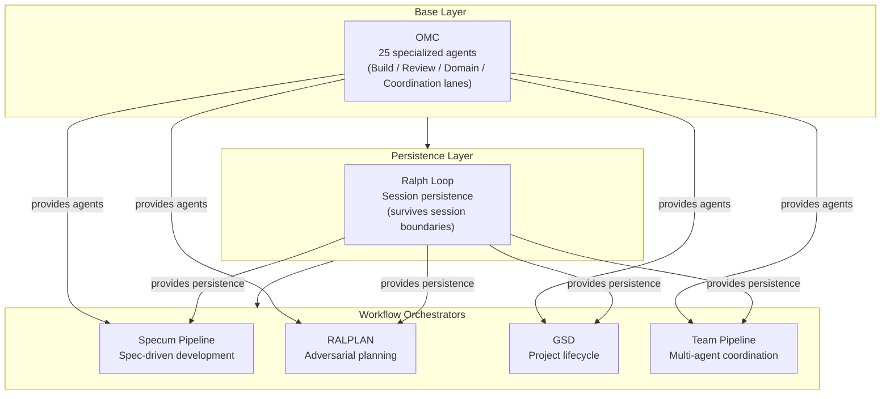
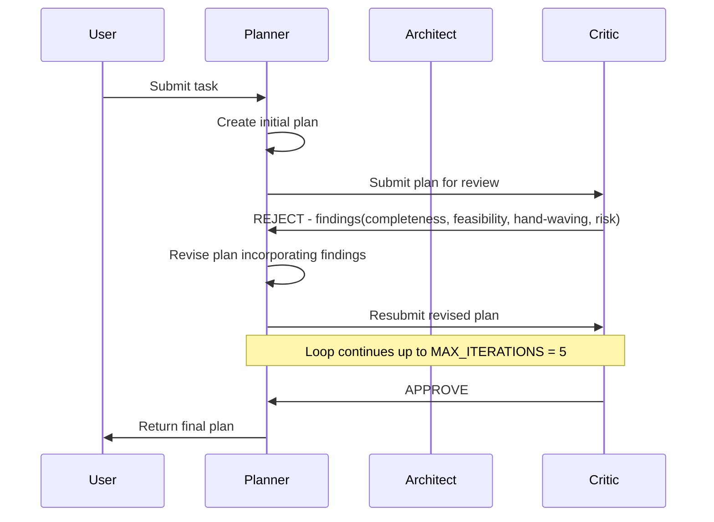
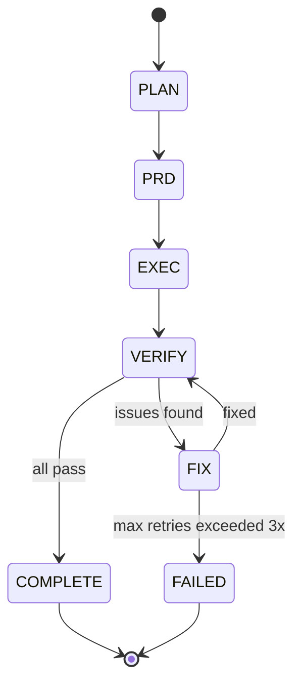

## The AI Development Operating System

*Agentic Development: 10 Lessons from 8,481 AI Coding Sessions*

I did not set out to build an operating system.

Over the past 90 days, across 8,481 Claude Code sessions, I kept hitting the same failures. An agent would lose context mid-task. A plan would survive first contact with the codebase for about six minutes before collapsing. Code review happened after the PR was already merged. Verification was a human squinting at a terminal and saying "looks good."

Each time I hit a failure mode, I built a small system to prevent it from happening again. An agent catalog here. A persistence layer there. An adversarial planning protocol after the third time a confident plan led to a dead end.

Ninety days later, I looked at what I had and realized: this is not a collection of scripts. It is an operating system for AI development. Six composable subsystems, each solving a specific class of failure, each usable independently but dramatically more powerful together.

This is the capstone post in the series. Everything I have learned, distilled into architecture you can run yourself.

The companion repository is at the end of this post. Every code block below is quoted from real, running source files.

---

### The Thesis

Here it is, plainly stated: the models are capable enough. What they need is a system.

A single Claude session can write excellent code. But software development is not a single session. It is research, planning, implementation, review, verification, and iteration -- spread across hours, days, and weeks. It requires specialization, persistence, adversarial challenge, and evidence-based verification.

These are not AI problems. These are organizational problems. Human engineering teams solved them decades ago with role specialization, code review, QA gates, and project management. The insight is that AI agents benefit from exactly the same organizational principles.

The AI Development Operating System encodes those principles into six composable subsystems.



---

### Subsystem 1: OMC -- The Agent Catalog

**Failure mode it solves:** using the wrong model for the job, or using a generalist when you need a specialist.

The first thing I built was a catalog of specialized agents. Not because specialization is theoretically elegant, but because I watched a $15/million-token Opus model spend 45 seconds doing file searches that Haiku could do in 1.5 seconds at one-twentieth the cost.

OMC (Oh My Claude Code) defines 25 agents organized into four lanes. Every agent has a full system prompt, a model tier assignment, and explicit capabilities. Here is the catalog structure from the YAML definition:

```yaml
# src/ai_dev_os/omc/catalog.yaml

version: "1.0.0"
description: "Complete OMC agent catalog for Claude Code orchestration"

agents:
  - name: explore
    lane: build
    model_tier: haiku
    description: "Codebase discovery, file/symbol mapping, dependency tracing"
    capabilities:
      - "Glob and Grep across large codebases efficiently"
      - "Map module boundaries and import graphs"
      - "Identify entry points, interfaces, and public APIs"

  - name: architect
    lane: build
    model_tier: opus
    description: "System design, component boundaries, interfaces, long-horizon architectural tradeoffs"
    capabilities:
      - "Design system boundaries and component responsibilities"
      - "Define API contracts and interface specifications"
      - "Evaluate architectural patterns: CQRS, event sourcing, hexagonal, etc."
```

The four lanes:

**Build Lane:** explore (haiku), analyst (opus), planner (opus), architect (opus), debugger (sonnet), executor (sonnet), deep-executor (opus), verifier (sonnet). This is your development team -- from discovery through implementation through verification.

**Review Lane:** quality-reviewer (sonnet), security-reviewer (sonnet), code-reviewer (opus). Three independent review perspectives that can run in parallel.

**Domain Lane:** test-engineer (sonnet), build-fixer (sonnet), designer (sonnet), writer (haiku), qa-tester (sonnet), scientist (sonnet), document-specialist (sonnet). Specialists you call when the task demands domain expertise.

**Coordination Lane:** critic (opus). One agent whose sole purpose is to find flaws in plans. More on this in the RALPLAN section.

Each agent is loaded as a typed model with full metadata:

```python
# src/ai_dev_os/omc/catalog.py

class AgentDefinition(BaseModel):
    """A single agent definition from the catalog."""

    name: str = Field(description="Unique agent identifier")
    lane: str = Field(description="Organizational lane: build, review, domain, coordination")
    model_tier: str = Field(description="Preferred model tier: haiku, sonnet, opus")
    description: str = Field(description="Brief one-line description")
    capabilities: list[str] = Field(default_factory=list)
    system_prompt: str = Field(description="Full system prompt for this agent")
```

The model routing table maps each agent to its canonical model tier, with cost and latency characteristics:

```python
# src/ai_dev_os/omc/routing.py

AGENT_MODEL_MAP: dict[str, ModelTier] = {
    # Build lane
    "explore": ModelTier.HAIKU,
    "analyst": ModelTier.OPUS,
    "planner": ModelTier.OPUS,
    "architect": ModelTier.OPUS,
    "debugger": ModelTier.SONNET,
    "executor": ModelTier.SONNET,
    "deep-executor": ModelTier.OPUS,
    "verifier": ModelTier.SONNET,
    # Review lane
    "quality-reviewer": ModelTier.SONNET,
    "security-reviewer": ModelTier.SONNET,
    "code-reviewer": ModelTier.OPUS,
    # Domain lane
    "test-engineer": ModelTier.SONNET,
    "build-fixer": ModelTier.SONNET,
    "designer": ModelTier.SONNET,
    "writer": ModelTier.HAIKU,
    # Coordination lane
    "critic": ModelTier.OPUS,
}
```

The routing is not just about cost. It encodes a fundamental principle: match cognitive depth to task complexity. The explore agent runs on Haiku because codebase discovery is breadth-first -- you want speed, not deep reasoning. The architect runs on Opus because system design requires holding many constraints in mind simultaneously. The executor runs on Sonnet because it is the best coding model -- fast enough to iterate, smart enough to get the implementation right.

The router also supports dynamic complexity scoring for tasks that do not map to a known agent:

```python
# src/ai_dev_os/omc/routing.py

COMPLEXITY_SIGNALS = {
    "high": [
        "architecture", "design", "system", "distributed", "scalab",
        "security", "critical", "production", "migrate", "refactor entire",
        "adversarial", "deep analysis", "comprehensive", "cross-cutting",
    ],
    "medium": [
        "implement", "debug", "review", "test", "fix", "build",
        "integrate", "api", "database", "async", "concurrent",
    ],
    "low": [
        "search", "find", "list", "summarize", "document", "format",
        "check", "scan", "quick", "simple", "lookup",
    ],
}
```

The self-hosting story: OMC started with 8 agents. Over 90 days, the system identified gaps -- situations where no existing agent was the right fit -- and I added specialists. The catalog grew from 8 to 25 agents, each one born from a real failure that the existing catalog could not handle.

---

### Subsystem 2: Ralph Loop -- Persistent Execution

**Failure mode it solves:** work dying when a session ends.

This is the subsystem with the most personality. Its motto: "The boulder never stops."

The problem is simple. Claude Code sessions end. The context window fills up. The laptop lid closes. But the work is not done. Ralph Loop provides persistent iterative execution that survives session boundaries by writing its entire state to disk after every iteration.

```python
# src/ai_dev_os/ralph_loop/state.py

class RalphTask(BaseModel):
    """A single task tracked within the Ralph Loop."""

    id: str = Field(description="Unique task identifier")
    title: str = Field(description="Short task title")
    description: str = Field(default="", description="Full task description")
    status: TaskStatus = Field(default=TaskStatus.PENDING)
    phase: Optional[str] = Field(default=None)
    created_at: datetime = Field(default_factory=datetime.utcnow)
    started_at: Optional[datetime] = None
    completed_at: Optional[datetime] = None
    attempts: int = Field(default=0, description="Number of execution attempts")
    error: Optional[str] = None

class RalphState(BaseModel):
    """Complete state for a Ralph Loop execution session."""

    iteration: int = Field(default=0)
    max_iterations: int = Field(default=100)
    task_list: list[RalphTask] = Field(default_factory=list)
    goal: str = Field(default="")
    started_at: datetime = Field(default_factory=datetime.utcnow)
    status: LoopStatus = Field(default=LoopStatus.RUNNING)
    linked_team: Optional[str] = Field(default=None)
    stop_reason: Optional[str] = None
```

The `iterate()` method is the heart of the system. Each call processes one iteration, logs progress, checks completion, and persists state:

```python
# src/ai_dev_os/ralph_loop/loop.py

def iterate(
    self,
    task_runner: Optional[Callable[[RalphTask], bool]] = None,
) -> bool:
    state = self.state
    state.iteration += 1

    # Check completion
    if self.check_completion():
        return False

    # Process next pending task
    pending = state.pending_tasks()
    if pending and task_runner:
        next_task = pending[0]
        next_task.mark_started()

        success = task_runner(next_task)
        if success:
            next_task.mark_completed()
        else:
            next_task.mark_failed("Task runner returned False")

    # Check max iterations
    if state.iteration >= state.max_iterations:
        state.status = LoopStatus.FAILED
        state.stop_reason = f"Max iterations ({state.max_iterations}) reached"
        self.persist_state()
        return False

    self.persist_state()
    return True
```

The key design choice: state is a flat JSON file at `.omc/state/ralph-state.json`. Not a database. Not a message queue. A JSON file. Because the most important property of persistence is that it actually works, and a JSON file on disk is the most reliable thing in computing. A new session reads it, picks up where the last one left off, and keeps going.

The completion check is deliberately strict -- all tasks must reach `COMPLETED` status:

```python
# src/ai_dev_os/ralph_loop/state.py

def is_complete(self) -> bool:
    if not self.task_list:
        return False
    return all(t.status == TaskStatus.COMPLETED for t in self.task_list)
```

---

### Subsystem 3: Specum Pipeline -- Spec Before Code

**Failure mode it solves:** jumping straight to implementation without understanding what to build.

I named it Specum because it forces you to specify before you implement. The pipeline enforces a mandatory sequence:

```python
# src/ai_dev_os/specum/pipeline.py

STAGE_ORDER = [
    PipelineStage.NEW,
    PipelineStage.REQUIREMENTS,
    PipelineStage.DESIGN,
    PipelineStage.TASKS,
    PipelineStage.IMPLEMENT,
    PipelineStage.VERIFY,
    PipelineStage.COMPLETE,
]

STAGE_DESCRIPTIONS = {
    PipelineStage.NEW: "Pipeline initialized, ready to begin",
    PipelineStage.REQUIREMENTS: "Gathering user stories and acceptance criteria",
    PipelineStage.DESIGN: "Creating schema definitions and API contracts",
    PipelineStage.TASKS: "Breaking design into ordered implementation tasks",
    PipelineStage.IMPLEMENT: "Executing tasks with Ralph Loop persistence",
    PipelineStage.VERIFY: "Validating completion with evidence collection",
    PipelineStage.COMPLETE: "Pipeline complete — all stages verified",
}
```

Each stage produces a markdown artifact that the next stage consumes. You cannot skip ahead. The pipeline will not let you implement before you have a design, and it will not let you design before you have requirements.

Notice stage five: "Executing tasks with Ralph Loop persistence." Specum and Ralph compose. The specification pipeline generates the task list; Ralph Loop executes it persistently. Two subsystems, each doing one thing well, combining into something neither could do alone.

Each stage also maps to its expected artifact file:

```python
# src/ai_dev_os/specum/pipeline.py

STAGE_ARTIFACTS = {
    PipelineStage.REQUIREMENTS: "requirements.md",
    PipelineStage.DESIGN: "design.md",
    PipelineStage.TASKS: "tasks.md",
    PipelineStage.IMPLEMENT: "implementation-report.md",
    PipelineStage.VERIFY: "verification-report.md",
}
```

---

### Subsystem 4: RALPLAN -- Adversarial Planning

**Failure mode it solves:** plans that sound confident but collapse on contact with reality.

RALPLAN is adversarial deliberation. A Planner creates a plan. A Critic tears it apart. The Planner revises. The Critic reviews again. This continues until the Critic approves or the maximum iteration count is reached.

The critical design constraint: the Critic can only identify problems. It cannot suggest solutions. This is not an arbitrary restriction -- it is the key to the whole protocol. When the critic suggests solutions, the planner becomes a secretary taking dictation. When the critic can only say "this is wrong," the planner must actually think about how to fix it.

```python
# src/ai_dev_os/ralplan/critic.py

class CriticFinding:
    """A specific finding from the critic's review."""

    severity: str  # CRITICAL, MODERATE, MINOR
    category: str  # completeness, feasibility, hand_waving, risk_coverage
    description: str
    plan_reference: Optional[str] = None

class CriticVerdict:
    """Complete verdict from the CriticAgent."""

    verdict: VerdictType
    critical_findings: list[CriticFinding] = field(default_factory=list)
    moderate_findings: list[CriticFinding] = field(default_factory=list)
    minor_findings: list[CriticFinding] = field(default_factory=list)
    rationale: str = ""

    @property
    def is_approved(self) -> bool:
        return self.verdict == VerdictType.APPROVE
```

The critic evaluates across four categories:

**Completeness:** Does the plan cover all required areas? Are there phases without verification criteria? Are there empty phases with no tasks?

**Feasibility:** Can this actually be built? Are tasks described with enough detail for an implementer to execute? Are high-complexity tasks flagged with risks?

**Hand-Waving:** The critic scans for vague language that hides implementation gaps:

```python
# src/ai_dev_os/ralplan/critic.py

hand_wave_phrases = [
    "implement the logic",
    "handle appropriately",
    "etc",
    "and so on",
    "as needed",
    "when necessary",
    "somehow",
    "figure out",
]
```

**Risk Coverage:** Are enough risks identified? Is there a proof-of-concept task for unknown territory?

The verdict is binary. Any critical finding means REJECT:

```python
# src/ai_dev_os/ralplan/critic.py

verdict = VerdictType.REJECT if critical else VerdictType.APPROVE
```

The deliberation loop runs the full protocol:

```python
# src/ai_dev_os/ralplan/deliberate.py

for iteration in range(1, MAX_ITERATIONS + 1):
    # Planner creates or revises the plan
    if current_plan is None:
        current_plan = self._planner.create_plan(task)
    else:
        criticism = "\n".join(
            f.description for f in current_verdict.critical_findings
        )
        current_plan = self._planner.revise_plan(current_plan, criticism)

    # Critic reviews the plan
    current_verdict = self._critic.review(current_plan)

    if current_verdict.is_approved:
        break
```

In extended deliberation mode (`--deliberate`), RALPLAN adds pre-mortem analysis -- imagining the plan has already failed and working backward to identify the most likely causes -- and expanded test planning across unit, integration, e2e, and observability layers.



---

### Subsystem 5: GSD -- The 10-Phase Project Lifecycle

**Failure mode it solves:** projects that start strong and then drift into undefined territory.

GSD (Get Stuff Done) is a 10-phase lifecycle with evidence gates. You cannot advance to the next phase without proving the current phase is complete. Not claiming it is complete. Proving it.

```python
# src/ai_dev_os/gsd/phases.py

class ProjectPhase(str, Enum):
    NEW_PROJECT = "new_project"
    RESEARCH = "research"
    ROADMAP = "roadmap"
    PLAN_PHASE = "plan_phase"
    EXECUTE_PHASE = "execute_phase"
    VERIFY_PHASE = "verify_phase"
    ITERATE = "iterate"
    INTEGRATION = "integration"
    PRODUCTION_READINESS = "production_readiness"
    COMPLETE = "complete"
```

Each phase has required evidence types that must be collected before the gate opens:

```python
# src/ai_dev_os/gsd/phases.py

PHASE_REQUIRED_EVIDENCE = {
    ProjectPhase.RESEARCH: ["research_document", "feasibility_assessment"],
    ProjectPhase.ROADMAP: ["roadmap_document", "success_criteria"],
    ProjectPhase.PLAN_PHASE: ["implementation_plan", "task_list"],
    ProjectPhase.EXECUTE_PHASE: ["build_log", "implementation_report"],
    ProjectPhase.VERIFY_PHASE: ["verification_report", "acceptance_criteria_results"],
    ProjectPhase.INTEGRATION: ["integration_test_results", "e2e_scenario_results"],
    ProjectPhase.PRODUCTION_READINESS: ["deployment_guide", "runbook", "monitoring_setup"],
    ProjectPhase.COMPLETE: ["final_report"],
}
```

The evidence collection system is its own module. Evidence is typed, timestamped, and traceable:

```python
# src/ai_dev_os/gsd/evidence.py

class EvidenceType(str, Enum):
    BUILD_LOG = "build_log"
    SCREENSHOT = "screenshot"
    API_RESPONSE = "api_response"
    TEST_OUTPUT = "test_output"
    MANUAL_VERIFICATION = "manual_verification"
    DOCUMENT = "document"
    METRIC = "metric"
    LOG_OUTPUT = "log_output"
    BENCHMARK_RESULT = "benchmark_result"
```

GSD also tracks assumptions explicitly through an `AssumptionTracker`. Assumptions made during planning that are never validated represent hidden risks. The tracker surfaces them at phase gates:

```python
# src/ai_dev_os/gsd/assumptions.py

class AssumptionTracker:
    """
    Tracks assumptions made during GSD project phases.

    Assumptions that are never validated represent hidden risks.
    This tracker surfaces unvalidated assumptions at phase gates,
    preventing projects from proceeding with invalid foundations.
    """

    def critical_unvalidated(self) -> list[Assumption]:
        """Return unvalidated assumptions with critical or high impact."""
        return [
            a for a in self.list_unvalidated()
            if a.impact in ("critical", "high")
        ]
```

This is the mechanism that prevents completion theater -- the common pattern where a team says "we are done" without anyone actually verifying the claim. With GSD, "done" is not a feeling. It is a collection of evidence artifacts that prove the work was completed.

---

### Subsystem 6: Team Pipeline -- Coordinated Multi-Agent Execution

**Failure mode it solves:** agents working in isolation without a shared understanding of state.

Team Pipeline is the orchestration layer. It coordinates N agents through a staged pipeline with a state machine that handles both the happy path and the inevitable failures:

```python
# src/ai_dev_os/team_pipeline/pipeline.py

PIPELINE_PROGRESSION = {
    PipelineStage.PLAN: PipelineStage.PRD,
    PipelineStage.PRD: PipelineStage.EXEC,
    PipelineStage.EXEC: PipelineStage.VERIFY,
    PipelineStage.VERIFY: PipelineStage.COMPLETE,  # on pass
    PipelineStage.FIX: PipelineStage.VERIFY,  # fix feeds back to verify
}
```

The pipeline: PLAN -> PRD -> EXEC -> VERIFY -> FIX (loop, bounded).

Each stage uses specialized agents from the OMC catalog. The PLAN stage uses explore (haiku) for fast codebase discovery and planner (opus) for task sequencing. The EXEC stage dispatches to the appropriate specialist based on the task:

```python
# src/ai_dev_os/team_pipeline/stages.py

class ExecStage(BaseStage):
    stage_name = "exec"
    required_agents = ["executor", "designer", "build-fixer", "writer", "test-engineer"]

    def _select_specialist(self, task: str) -> str:
        task_lower = task.lower()
        if any(kw in task_lower for kw in ["ui", "design", "ux", "interface", "layout"]):
            return "designer"
        elif any(kw in task_lower for kw in ["test", "coverage", "spec", "tdd"]):
            return "test-engineer"
        elif any(kw in task_lower for kw in ["doc", "readme", "guide", "changelog"]):
            return "writer"
        elif any(kw in task_lower for kw in ["complex", "architecture", "refactor entire", "migrate"]):
            return "deep-executor"
        else:
            return "executor"
```

The transition logic handles the critical verify-fix loop. When verification fails, the pipeline enters the FIX stage. Fix feeds back to VERIFY. If verification fails again and the fix loop count exceeds the bound, the pipeline transitions to FAILED:

```python
# src/ai_dev_os/team_pipeline/pipeline.py

def _transition(self, current: PipelineStage, result: StageResult) -> None:
    state = self.state

    if current == PipelineStage.VERIFY:
        if result.success:
            state.current_stage = PipelineStage.COMPLETE
            state.status = PipelineStatus.COMPLETE
        else:
            if state.fix_loop_count >= state.max_fix_loops:
                state.current_stage = PipelineStage.FAILED
                state.status = PipelineStatus.FAILED
            else:
                state.fix_loop_count += 1
                state.current_stage = PipelineStage.FIX

    elif current == PipelineStage.FIX:
        state.current_stage = PipelineStage.VERIFY
```

The bounded fix loop is important. Without it, a failing pipeline could loop forever. Three fix attempts is the default. If you cannot fix a verification failure in three passes, the problem is likely architectural, not a simple bug.



---

### The Unified CLI

All six subsystems are accessible through a single CLI:

```python
# src/ai_dev_os/cli.py

@click.group()
@click.version_option(version="1.0.0", prog_name="ai-dev-os")
def main() -> None:
    """
    AI Development Operating System CLI.

    Orchestrate Claude Code agents across complex software projects
    using OMC, Ralph Loop, Specum, RALPLAN, GSD, and Team Pipeline.

    Quick Start:
      ai-dev-os catalog list           # See all 25+ agents
      ai-dev-os ralph start --task "Build auth system"
      ai-dev-os spec new --goal "Implement payment processing"
      ai-dev-os gsd new-project --name myapp
    """
```

This is not six disconnected tools bolted together. The subsystems compose:

- RALPLAN produces plans. Ralph Loop persists their execution.
- Specum generates task lists. Team Pipeline coordinates agents to execute them.
- GSD manages the project lifecycle. Each phase can invoke any subsystem.
- OMC provides the agent catalog that every other subsystem draws from.
- Evidence collection in GSD verifies work done by Team Pipeline.
- The Critic from RALPLAN can review plans generated by any subsystem.

---

### The Composability Insight

The most important thing I learned is that composability beats integration. Each subsystem is useful on its own. Ralph Loop can persist any iterative workflow, not just those generated by Specum. RALPLAN can critique any plan, not just those from GSD. The OMC catalog serves any orchestrator, not just Team Pipeline.

This is the same lesson the Unix community learned decades ago: small, composable tools that do one thing well are more powerful than monolithic systems that try to do everything.

Here is a concrete example. To build a new feature using the full system:

```bash
ai-dev-os plan --task "Add payment processing" --consensus
ai-dev-os spec new --goal "Implement Stripe integration"
ai-dev-os ralph start --task "Execute Specum task list"
ai-dev-os team start --task "Parallel agent implementation"
ai-dev-os gsd new-project --name payments --goal "Production payment system"
```

Each command invokes a different subsystem. Each subsystem reads state from the others. The result is a coordinated development workflow where no single component knows about all the others, but together they cover the full lifecycle.

---

### The Self-Hosting Loop

There is one more thing worth mentioning. This system built itself.

The first version had 8 agents and no adversarial planning. I used it to build features. The features had bugs because the plans were not challenged. So I built RALPLAN to challenge plans. RALPLAN found gaps in the agent catalog. So I added agents. The new agents needed coordination. So I built Team Pipeline. Team Pipeline needed persistence. So I connected it to Ralph Loop.

Each subsystem was built using the subsystems that already existed. The agent catalog was designed by the architect agent. The RALPLAN protocol was planned by the planner agent and critiqued by the critic agent -- before the critic agent formally existed, which required manually playing the critic role and then encoding the pattern.

Over 90 days, the system grew from 8 agents to 25. From one subsystem to six. Each addition was driven by a real failure, not theoretical elegance. The operating system evolved through the same process it now manages: research, plan, execute, verify, iterate.

---

### The Bottom Line

After 8,481 sessions, here is what I know: AI development benefits from the same organizational principles that human teams discovered decades ago.

**Specialization works.** Not every task needs the most powerful model. An explore agent on Haiku finds files faster than an architect on Opus, because it is built for that specific job.

**Persistence works.** Work that survives session boundaries is qualitatively different from work that dies when the terminal closes.

**Adversarial review works.** Plans that face a critic before implementation are plans that survive implementation.

**Evidence-based verification works.** "It looks done" is not the same as "here is the build log, the API response, and the screenshot proving it works."

**Coordination works.** Multiple specialized agents working through a structured pipeline produce better results than one generalist agent trying to do everything.

None of these are novel ideas. They are the accumulated wisdom of decades of software engineering practice. The novelty is applying them to AI agents -- and discovering that they work just as well for silicon as they do for carbon.

The models are capable enough. What they need is a system.

---

Companion Repository: [github.com/nickbaumann98/ai-dev-operating-system](https://github.com/nickbaumann98/ai-dev-operating-system)

All code quoted in this post is from real, running source files. The repository includes the full OMC catalog (25 agents with system prompts), Ralph Loop, Specum Pipeline, RALPLAN deliberation, GSD lifecycle, and Team Pipeline. MIT licensed.

---

*Part 11 of 11 in the [Agentic Development](https://github.com/krzemienski/agentic-development-guide) series.*
