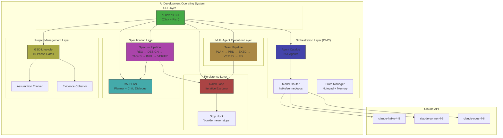
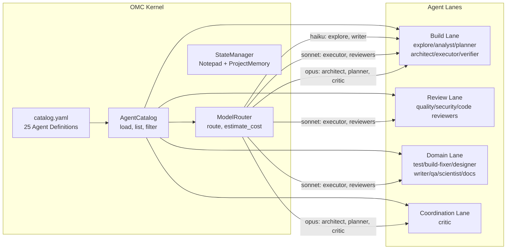
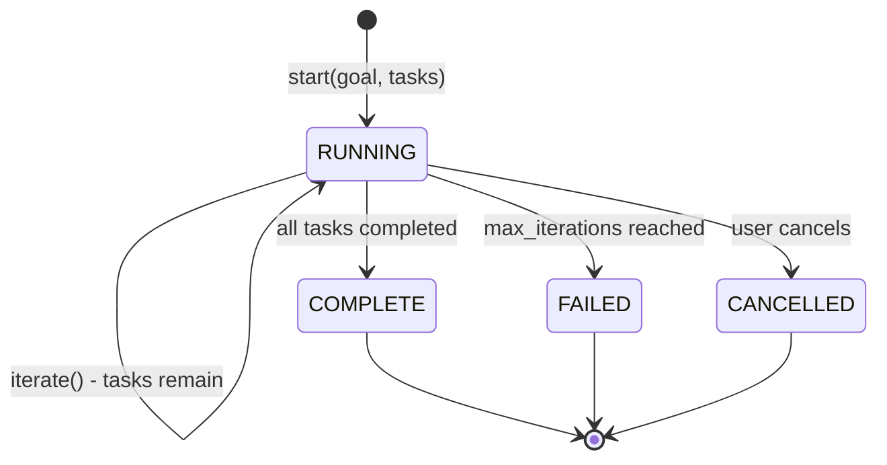
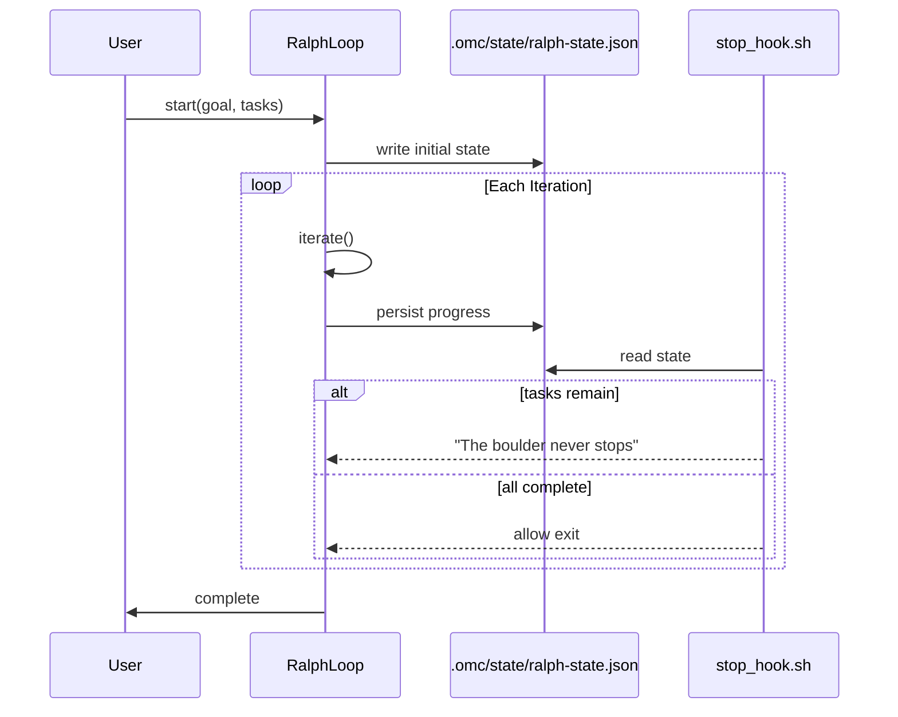
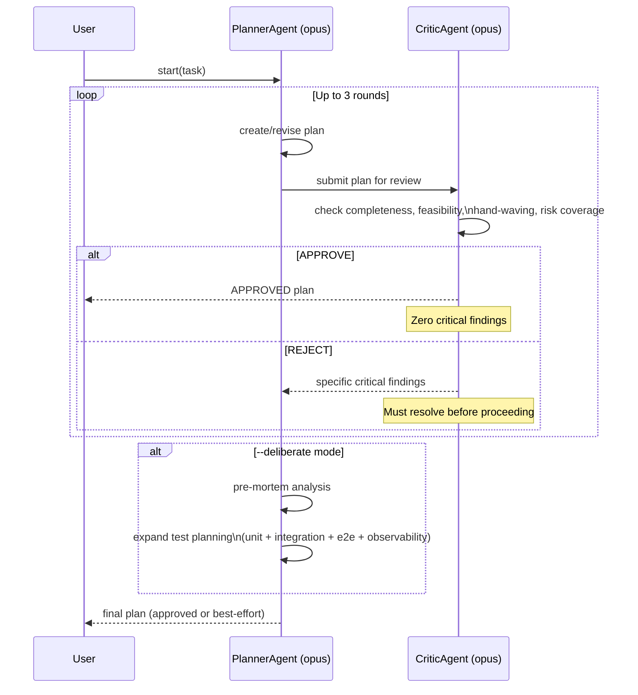
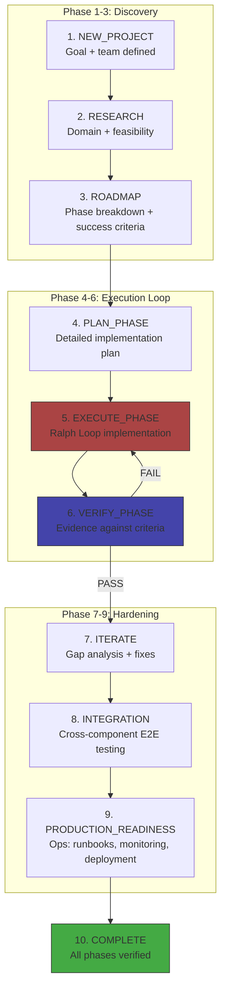
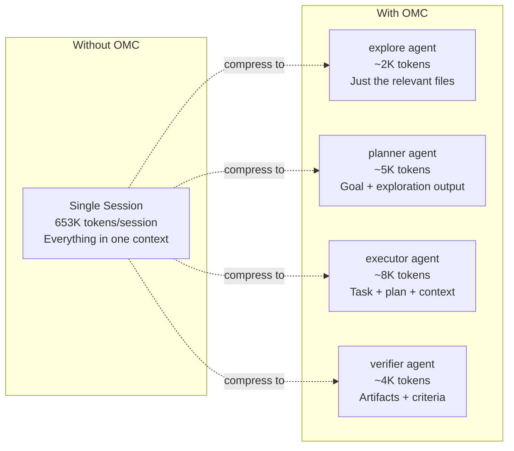

# System Architecture

The AI Development Operating System is a layered meta-framework where each layer
builds on the one below it. This document describes the architecture of each component
and how they compose into a complete system.

---

## Full System Architecture



---

## OMC Orchestration Layer

The OMC layer is the kernel of the system — it provides agent definitions,
routing logic, and state management that all other layers depend on.



**Key design decisions:**

1. **YAML catalog, not code:** Agent definitions live in `catalog.yaml` — readable, editable, and version-controllable without touching Python.

2. **Routing is a table, not an algorithm:** The model routing table is deterministic. `get_agent("architect") → opus`. No heuristics needed.

3. **State is file-based:** `.omc/state/` contains JSON files readable by any tool. No database dependency.

---

## Ralph Loop — Persistence Engine

The Ralph Loop solves the fundamental AI agent problem: sessions end, work doesn't.



**How persistence works:**



**The stop hook mechanism:** When Claude Code tries to end a session, the stop hook reads
the Ralph state file. If tasks remain, it outputs "The boulder never stops" — the OMC signal
to continue working. This creates a self-enforcing persistence loop.

---

## Specum — Specification Pipeline

Specum enforces the discipline of specifying before implementing.
Each stage produces a markdown artifact consumed by the next.

```mermaid
graph LR
    Goal["Goal String"]

    subgraph "Stage 1: Requirements"
        Analyst["ProductManagerAgent\n(analyst/opus)"]
        ReqMD["requirements.md\n- User stories\n- Acceptance criteria\n- Constraints\n- Open questions"]
    end

    subgraph "Stage 2: Design"
        Architect["ArchitectAgent\n(architect/opus)"]
        DesignMD["design.md\n- Component diagram\n- Data model\n- API contract\n- Tech decisions"]
    end

    subgraph "Stage 3: Tasks"
        Planner["TaskPlannerAgent\n(planner/opus)"]
        TasksMD["tasks.md\n- Phased task list\n- Dependencies\n- Verification gates"]
    end

    subgraph "Stage 4: Implement"
        Executor["ExecutorAgent\n(executor/sonnet)\n+ RalphLoop"]
        ImplReport["implementation-report.md\n- Task status\n- Evidence\n- Build logs"]
    end

    subgraph "Stage 5: Verify"
        Verifier["VerifierAgent\n(verifier/sonnet)"]
        VerifyReport["verification-report.md\n- PASS/FAIL verdict\n- Criteria checked\n- Gaps found"]
    end

    Goal --> Analyst --> ReqMD
    ReqMD --> Architect --> DesignMD
    DesignMD --> Planner --> TasksMD
    TasksMD --> Executor --> ImplReport
    ImplReport --> Verifier --> VerifyReport
```



**The gate principle:** Each stage can only start when the previous stage's artifact exists.
You cannot design without requirements. You cannot implement without a task list.
Stages cannot be skipped — each one is a checkpoint.

---

## RALPLAN — Adversarial Deliberation

RALPLAN prevents bad plans from reaching execution through adversarial iteration.



**Critic rules:**
- The critic issues APPROVE or REJECT — nothing in between
- REJECT means at least one CRITICAL finding must be resolved
- The critic does NOT suggest improvements — only identifies failures
- Three iterations maximum — prevents infinite deliberation loops

---

## GSD — 10-Phase Project Lifecycle

GSD provides a complete project management framework from idea to production.



**Phase gates:** Each phase requires evidence before transition.
The `EvidenceCollector` stores proof (build logs, screenshots, test output).
The `AssumptionTracker` surfaces unvalidated assumptions that could block phases.

**The evidence requirement by phase:**

| Phase | Required Evidence |
|-------|------------------|
| RESEARCH | research_document, feasibility_assessment |
| ROADMAP | roadmap_document, success_criteria |
| PLAN_PHASE | implementation_plan, task_list |
| EXECUTE_PHASE | build_log, implementation_report |
| VERIFY_PHASE | verification_report, acceptance_criteria_results |
| INTEGRATION | integration_test_results, e2e_scenario_results |
| PRODUCTION_READINESS | deployment_guide, runbook, monitoring_setup |

---

## Team Pipeline — Multi-Agent Execution

The Team Pipeline coordinates multiple specialized agents through a bounded, verifiable pipeline.

```mermaid
stateDiagram-v2
    [*] --> team-plan: start(task)

    team-plan --> team-prd: exploration + plan complete
    team-prd --> team-exec: acceptance criteria defined
    team-exec --> team-verify: implementation complete

    team-verify --> complete: PASS (all criteria met)
    team-verify --> team-fix: FAIL (findings remain)

    team-fix --> team-verify: fixes applied

    team-fix --> failed: max_fix_loops exceeded
    complete --> [*]
    failed --> [*]
    cancelled --> [*]
```

**Stage agent assignments:**

| Stage | Primary Agents | Model |
|-------|---------------|-------|
| team-plan | explore + planner | haiku + opus |
| team-prd | analyst | opus |
| team-exec | executor, designer, build-fixer, writer | sonnet (or haiku for writer) |
| team-verify | verifier + security-reviewer | sonnet |
| team-fix | executor, build-fixer, or debugger (by defect type) | sonnet |

**Fix loop bound:** The fix loop is bounded by `max_fix_loops` (default: 3).
Exceeding the bound transitions to FAILED terminal state, preventing infinite cycling.

---

## Context Window Economics

This architecture is designed to minimize context window consumption while maximizing output quality.



**Real session economics (8,481 sessions, 90 days):**
- Average session: 653K tokens without compression
- With OMC agent isolation: ~20K tokens per specialized agent
- **Compression ratio: 97% reduction in per-agent context**

**Why this works:**
1. Specialized agents only see what they need (explore doesn't need the full codebase history)
2. Artifacts are the interface — not raw conversation context
3. State files persist decisions without re-deriving them in every agent call
4. Model routing means cheap agents handle cheap tasks (haiku for file scans)

---

## Composition Patterns

These components compose naturally into higher-order workflows:

### specum + ralph
```
Specum drives the spec pipeline → IMPLEMENT stage spawns RalphLoop
→ tasks persist across iterations → Specum advances to VERIFY when complete
```

### gsd + team_pipeline
```
GSD provides the project lifecycle → EXECUTE_PHASE spawns TeamPipeline
→ TeamPipeline runs PLAN→EXEC→VERIFY → evidence feeds GSD phase gate
→ GSD advances to VERIFY_PHASE when TeamPipeline completes
```

### ralplan + specum
```
RALPLAN deliberates on the approach → approved plan feeds into Specum
→ Specum starts at DESIGN (plan satisfies REQUIREMENTS gate)
→ Specum runs remaining stages to completion
```

### team_pipeline + ralph
```
Team Ralph mode: TeamPipeline orchestrates stages
→ RalphLoop wraps the entire pipeline for persistence
→ If TeamPipeline is interrupted, RalphLoop resumes from last stage
→ Stop hook prevents exit until pipeline reaches terminal state
```
